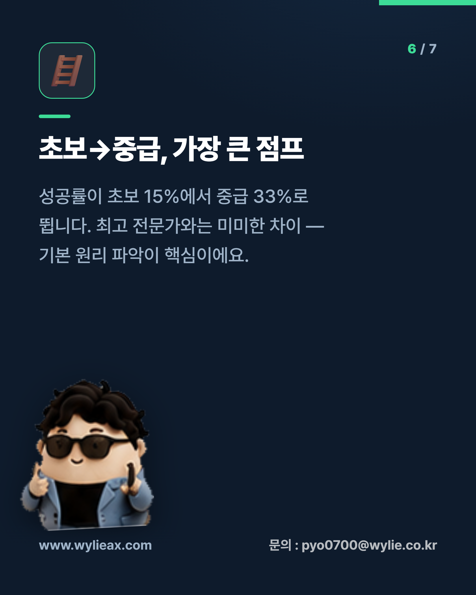

# 카드뉴스 제작 하네스 (Card News Harness)

인스타그램용 세로형(1080×1350) 카드뉴스를 **HTML/CSS 템플릿 → Playwright PNG 렌더**로 만드는 환경.
AI 이미지 생성 없이 한글 텍스트를 픽셀-퍼펙트로 렌더합니다.

## 특징
- 🇰🇷 **한글 픽셀-퍼펙트** — HTML/CSS 렌더라 글자가 깨지지 않음
- 🎨 **테마** — 다크/라이트(`config/theme*.json`)
- 🖼️ **사진 활용 2모드** — (1) 이미지에서 내용 추출 → 카피 생성, (2) 카드에 사진 삽입(풀블리드 배경 / 상단 밴드)
- 😀 **이모지 아이콘** — 콘텐츠 슬라이드별 컬러 이모지
- 🧑 **캐릭터/포즈** — `haroo` 캐릭터 포즈 라이브러리(`assets/poses/`), 슬라이드별 포즈 지정
- 🔻 **자동 요소** — 커버 스와이프 힌트, 콘텐츠 페이지 표시, 푸터 가독성 스크림
- ⚙️ **다이나믹 워크플로우** — 주제 한 줄 → 멀티에이전트가 카피 자동 생성(`workflows/`)

## 결과 예시
<p>
  
  
  
</p>

## 빠른 시작
```bash
npm install                       # 최초 1회 (playwright)
npx playwright install chromium   # 최초 1회 (브라우저)
node scripts/render.mjs content/ai-domain-expertise.json
# -> output/ai-domain-expertise/01_cover.png ... 07_outro.png
```

## 새 카드뉴스 만들기
1. `content/<주제>.json` 작성 (아래 스키마 참고)
2. `node scripts/render.mjs content/<주제>.json [config/theme.json] [outDir]`
3. `output/<주제>/` 에서 PNG 확인

## 콘텐츠 스키마
```jsonc
{
  "meta": {
    "brand": "www.wylieax.com",            // 푸터 좌측 (웹사이트)
    "contact": "문의 : pyo0700@wylie.co.kr", // 푸터 우측 (연락처)
    "topic": "주제명",                       // outro 배지/라벨
    "character": "assets/poses/09.png"       // (선택) 기본 캐릭터
  },
  "slides": [
    { "type": "cover",   "badge": "라벨", "title": "줄바꿈은 \\n", "subtitle": "부제",
      "char": { "src": "assets/poses/09.png", "pos": "br", "h": 600 } },
    { "type": "content", "index": "01", "icon": "⚡", "heading": "소제목", "body": "본문",
      "char": { "src": "assets/poses/32.png", "pos": "bl", "h": 320, "flip": true, "rot": -3 } },
    { "type": "content", "index": "02", "image": "assets/photo.jpg", "heading": "...", "body": "..." },
    { "type": "outro",   "title": "마무리 문구", "cta": "행동 유도" }
  ]
}
```
- `image`: 슬라이드에 사진 삽입(cover/outro=풀블리드 배경, content=상단 밴드, `fullBleed:true` 강제)
- `icon`: 컬러 이모지 칩(content)
- `char`: 슬라이드별 캐릭터 `{ src, pos:'bl'|'br', h, flip, rot, show }` — 포즈 목록은 `assets/poses/_contact_dark.png` 참고

## 테마 변경
```bash
node scripts/render.mjs content/sample.json config/theme-light.json output/sample-light
```

## 구조
| 경로 | 역할 |
|------|------|
| `config/theme*.json` | 색상·폰트·규격 (다크/라이트) |
| `content/*.json` | 카드 콘텐츠 |
| `templates/card.html` | HTML/CSS 템플릿 + `renderSlide()` |
| `scripts/render.mjs` | Playwright 렌더 엔진 |
| `workflows/card-news-generator.js` | 다이나믹 콘텐츠 생성 워크플로우 |
| `assets/poses/` | haroo 캐릭터 포즈 라이브러리(투명 PNG) |
| `output/` | 생성 결과 PNG |

진행 기록: [Progress.md](Progress.md)
